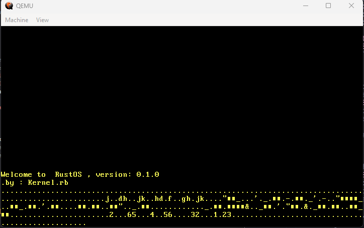

# MyOS 💻

MyOS is a simple operating system project .


## Directory Structure 📂

- **.cargo**: Contains Cargo related configurations.
- **.notes**: Directory for personal notes.
- **src**: Contains the source code of the operating system.
  - **allocator**: Source code related to memory allocation.
  - **task**: Source code related to task management.
- **target**: Directory where build outputs are stored.
- **tests**: Contains tests for the operating system.
- **.gitignore**: Specifies intentionally untracked files to ignore.
- **Cargo.lock**: Automatically generated file that locks dependencies.
- **Cargo.toml**: Manifest file for Rust projects.
- **README.md**: You are here.
- **x86_64.json**: JSON file containing x86_64 target specifications.

## Source Code Details 📝

### allocator
- **bump.rs**: Implementation of a bump allocator.
- **fixed_size_block.rs**: Implementation of a fixed size block allocator.
- **linked_list.rs**: Implementation of a linked list allocator.

### task
- **executor.rs**: Task executor implementation.
- **keyboard.rs**: Keyboard task implementation.
- **mod.rs**: Module declaration.
- **simple_executor.rs**: Simple task executor implementation.

## Tests 🧪
- **basic_boot.rs**: Test for basic boot functionality.
- **heap_allocation.rs**: Test for heap memory allocation.
- **should_panic.rs**: Test for panic behavior.
- **stack_overflow.rs**: Test for stack overflow.

## Launching the OS 🚀

To build and run MyOS, follow these instructions:

1.Clone the repository to your local machine 
```bash
git clone  https://github.com/Kernel-rb/MyOS.git
```

2. Change the working directory to the project directory
```bash
cd MyOS
```

3. Build the project using Cargo
```bash
cargo build
```

4. Run the project using QEMU
```bash
cargo run
```

## Helpful Resources

For more insights into operating system development in Rust, consider referring to the following blog: [The Blog of Philipp Oppermann](https://os.phil-opp.com/). 📖
